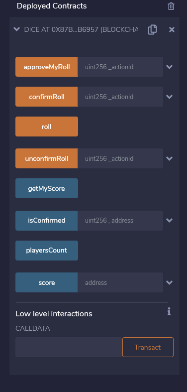
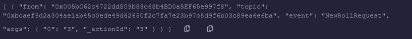
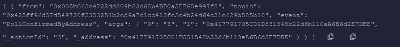
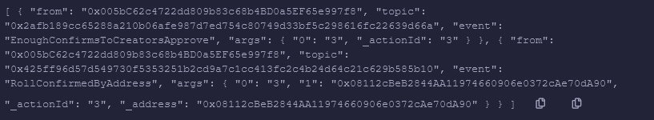
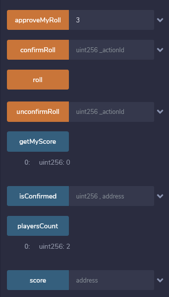
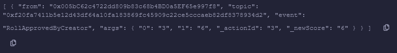
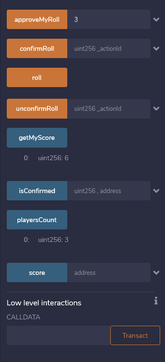

# Dice multicig example

### Functionality

Allows all players to controls all rolls of 12-sided dice.

Alghorithm is:
  
  1)Player (or not) send roll() to roll dice
  
  2)His action must be confirmed by all players
  
  3)After that player (or not) can approve his action(roll). After approvement he becomes a player if he was not.
  
  4)If player wants to reroll his score, he needs to get confirmations from all players too

### Example

Contract was deployed by first address, second now is player too (because his roll was confirmed by first address).

Now we work with third address. Sending roll() from third address:

Trying to approve without confirmations from all(2) players:

Confirmation from first address:

Confirmation from second(final) address:

State for third address before approvement:

State for third address after approvement:

### Kovan network address
0x2Ce3567764e220F5d24Caa3fBc05afFfa8D10f2c

